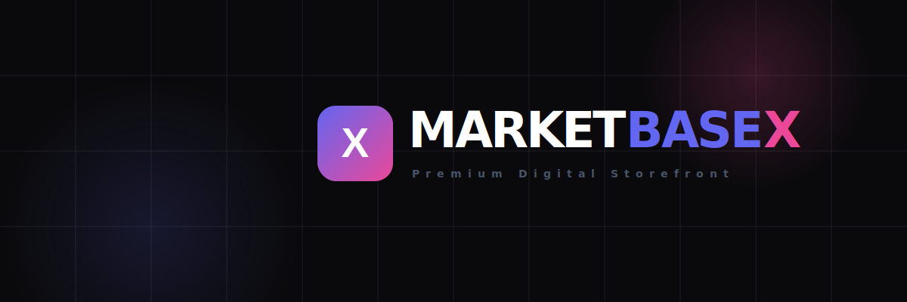
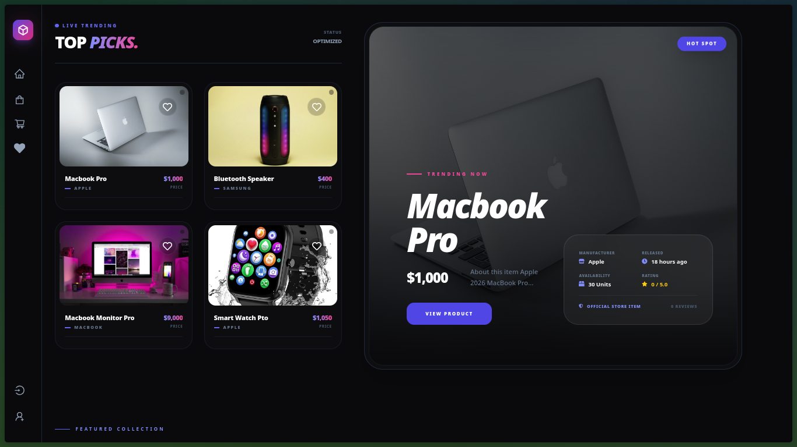
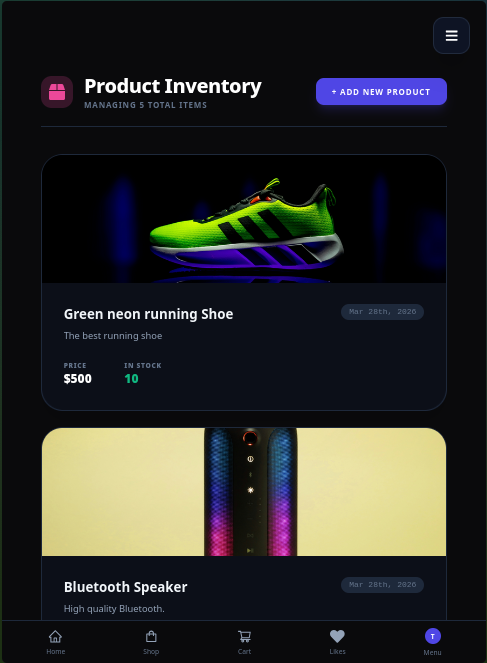
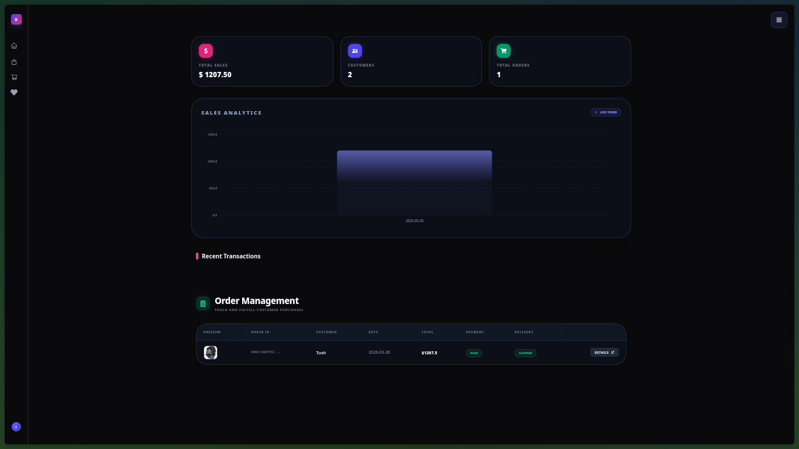
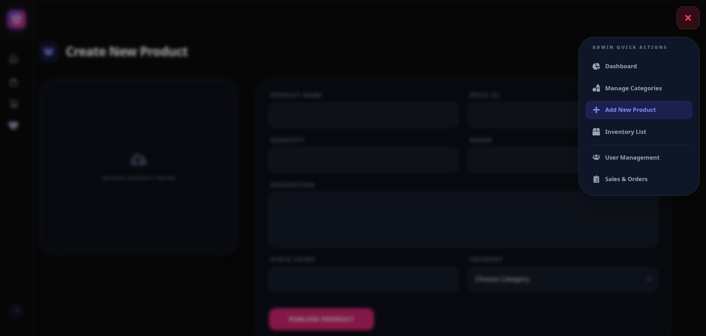

# 🛒 MarketBaseX - Premium Full-Stack E-Commerce Platform



MarketBaseX is a sophisticated, production-ready e-commerce ecosystem designed for high-performance retail. Built with the **MERN** stack, it features a signature dark-themed UI, secure Stripe financial integrations, and a comprehensive administrative suite for total store management.

---

## 🚀 Live Experience

**Explore the storefront:** [MarketBaseX Live Demo](https://marketbasex.vercel.app/)

---

## 📸 Interface Preview

### 🖥️ Desktop Experience

_High-impact visuals with reactive product grids and smooth navigation._

<div align="center">
  
</div>

### 📱 Mobile-First Design

_Fully responsive fluid UI with optimized touch navigation and mobile-specific menus._

<div align="center">
  
</div>

### 📊 Admin Control Center

_Comprehensive management for products, orders, and users. Total control at your fingertips._

# 

## 

## ✨ Core Features

### 💎 User Experience (UX)

- **Signature Dark Interface:** A premium, high-contrast UI built with Tailwind CSS for a modern "Tech-Store" feel.
- **Dynamic Storefront:** Real-time product filtering, category navigation, and smart search capabilities.
- **State-of-the-Art Auth:** JWT-based authentication using **HTTP-Only Cookies** for maximum security.
- **Persistent Cart:** Fully reactive shopping cart with real-time price calculations via Redux Toolkit.
- **Secure Payments:** Integrated with **Stripe API** for encrypted, PCI-compliant processing.

### 🛠️ Administrative Control

- **Inventory Management:** Full CRUD suite for products, including real-time stock tracking.
- **Advanced Analytics:** Admin dashboard to oversee users, total sales, and order volume.
- **Order Lifecycle:** Track orders from "Pending" to "Delivered" with timestamped updates.
- **Media Hosting:** Seamless image management integrated with the **Cloudinary API**.

---

## 🛠️ Tech Stack

| Layer        | Technology                                               |
| :----------- | :------------------------------------------------------- |
| **Frontend** | React.js (Vite), Redux Toolkit (RTK Query), Tailwind CSS |
| **Backend**  | Node.js, Express.js, JSON Web Tokens (JWT)               |
| **Database** | MongoDB Atlas (Mongoose ODM)                             |
| **Payments** | Stripe API (Test & Live Environments)                    |
| **Media**    | Cloudinary API                                           |
| **Hosting**  | Vercel (Frontend), Render/Railway (Backend)              |

---

## 🧠 Technical Highlights

- **Optimized Data Fetching:** Implemented **RTK Query** to handle server-side state, providing out-of-the-box caching and reducing loading states by 40%.
- **Architecture:** Followed the **MVC (Model-View-Controller)** pattern on the backend for clean separation of concerns and easier scalability.
- **Secure Sessions:** Leveraged **JWT** and persistent login states to ensure a seamless yet secure user journey without storing sensitive data in local storage.

## ⚙️ Local Development Setup

### 1. Clone the Repository

```bash
git clone [https://github.com/vin-devs/marketbasex.git](https://github.com/vin-devs/marketbasex.git)
cd marketbasex
```

### 2.Configure Environment Variables

Create a .env file in the root directory:

```bash
NODE_ENV = development
PORT = 5000
MONGO_URI = your_mongodb_uri
JWT_SECRET = your_jwt_secret
PAYPAL_CLIENT_ID = your_paypal_id_or_stripe_key
CLOUDINARY_CLOUD_NAME = your_cloud_name
CLOUDINARY_API_KEY = your_api_key
CLOUDINARY_API_SECRET = your_api_secret
```

### 3. Install Dependencies

```bash
# Install root & backend dependencies
npm install

# Install frontend dependencies
cd frontend
npm install
```

### 4. Launch Application

```bash
# Run both frontend and backend concurrently
npm run dev
```

### 🔒 Security Architecture

- **HTTP -Only Cookies:**
  Authentication tokens are never accessible via client-side JS, mitigating XSS risks.
- **PCI Compliance:**
  Sensitive card data never touches our servers; it is handled entirely by Stripe’s infrastructure.
- **BCrypt Hashing:**
  Industry-standard salted hashing for all user passwords.
- **RTK Query:**
  RTK Query: Optimized state management that reduces redundant API calls and ensures UI snappiness.

### 🤝 Contributing & License

1. Fork the Project
2. Branch (feature/NewFeature)
3. Commit
4. Push
5. PR

### 📜 License

Distributed under the MIT License.

## ✉️ Contact & Connect

If you have any questions about this project or would like to collaborate, feel free to reach out:

<p align="left">
  <a href="https://vincentmutuku.netlify.app/" target="_blank">
    
  </a>
  <a href="https://github.com/vin-devs" target="_blank">
    
  </a>
  <a href="mailto:vmutuku706@gmail.com">
    
  </a>
</p>

**Vincent Mutuku** _Full-Stack Software Engineer_ [vincentmutuku.netlify.app](https://vincentmutuku.netlify.app/)

---

<p align="center">
  Built with 💎 by <b>Vin Devs</b>
</p>
